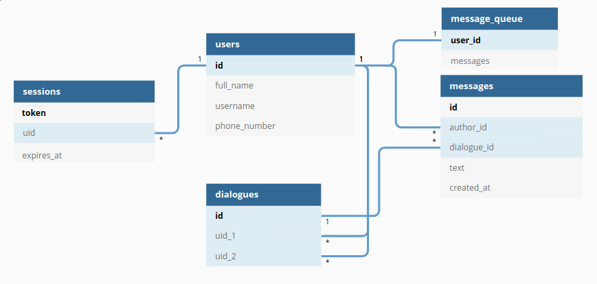
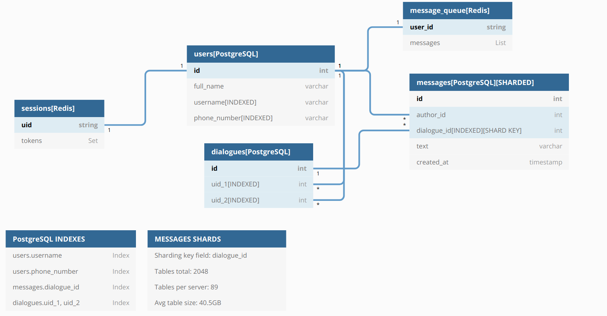

# Курс Highload. Проект веб-сервиса

### Выбор темы

Сервис-мессенджер (Telegram)

Функционал MVP: отправка и получение текстовых сообщений, которые сохраняются на сервере в открытом виде. 

### Расчет нагрузки

* Аудитория: 7 миллионов человек ([аудитория Facebook Messenger в 2020 году](https://www.dp.ru/a/2020/10/17/Auditorija_Telegram_v_Ross))

* География пользователей: РФ

* Среднее кол-во сообщений в день на одного пользователя: [150](https://bloggingx.com/telegram-statistics/#:~:text=Telegram%20user%20and%20usage%20statistics&text=It%20is%20estimated%20that%20around,sent%20daily%20per%20Telegram%20user.)

* Средняя длительность сессии: [12 минут](https://www.likeni.ru/events/whatsapp-samyy-populyarnyy-messendzher-u-abonentov-bilayna/) 

* Максимальная длина одного сообщения: 4096 символов ([макс. размер сообщения в Telegram](https://www.vamtlgrm.com/limity-sushhestvuyushhie-v-telegram/#:~:text=%D0%94%D0%BB%D0%B8%D0%BD%D0%B0%20%D0%BE%D0%B4%D0%BD%D0%BE%D0%B3%D0%BE%20%D1%81%D0%BE%D0%BE%D0%B1%D1%89%D0%B5%D0%BD%D0%B8%D1%8F%20%D0%B2%20%D0%BB%D0%B8%D1%87%D0%BD%D1%8B%D1%85,%D0%B8%20%D0%BA%D0%B0%D0%BD%D0%B0%D0%BB%D0%B0%D1%85%20%E2%80%94%20%D0%B4%D0%BE%201024%20%D1%81%D0%B8%D0%BC%D0%B2%D0%BE%D0%BB%D0%BE%D0%B2.))

* Среднее кол-во диалогов пользователя: 150 ([число Данбара](https://ru.wikipedia.org/wiki/%D0%A7%D0%B8%D1%81%D0%BB%D0%BE_%D0%94%D0%B0%D0%BD%D0%B1%D0%B0%D1%80%D0%B0))

* Размер одного сообщения: 9 Кб (сообщ. макс. длины на кириллице, закодированное в UTF-8 + 1 кб метаданных)

* Дополнительные запросы: получение списка сообщений в диалоге (новые сообщения отправляются в виде дельты), получение более ранних сообщений (при прокрутке диалога пользователь получает 100 предыдущих сообщений)

* Общее кол-во запросов в сутки:
  
  * 150 отправок сообщений
  
  * 150 получаемых сообщений
  
  * 25 запросов на получение списка чатов ([статистика](https://www.tadviser.ru/index.php/%D0%A1%D1%82%D0%B0%D1%82%D1%8C%D1%8F:%D0%9C%D0%B5%D1%81%D1%81%D0%B5%D0%BD%D0%B4%D0%B6%D0%B5%D1%80%D1%8B_(Instant_Messenger,_IM)#:~:text=%D0%9A%D0%B0%D0%BA%20%D0%B2%D1%8B%D1%8F%D1%81%D0%BD%D0%B8%D0%BB%D0%BE%D1%81%D1%8C%2C%20%D0%B2%20%D1%81%D1%80%D0%B5%D0%B4%D0%BD%D0%B5%D0%BC%20%D0%BF%D0%BE%D0%BB%D1%8C%D0%B7%D0%BE%D0%B2%D0%B0%D1%82%D0%B5%D0%BB%D1%8C,%D0%B8%D0%B4%D1%83%D1%82%20Viber%2C%20Telegram%20%D0%B8%20Skype.) использования мессенджеров)
  
  * 50 запросов на получение дельты списка чатов
  
  * 300 просмотров диалога (пользователь открывает диалог при получении и при отправке сообщений)
  
  * 25 просмотров истории диалога

* Avg Requests Per Day
  
  * : 7 * 10^6 * (150+150+25+50+300+25) = 4.7 * 10^9 rpd

* Avg Requests Per Second:
  
  * 4.7 * 10^9 / 24 / 60 / 60 = 54'700 rps

* Read requests:
  
  * 7 * 10^6 * (150+25+50+300+25) = 3.85 * 10^9 rpd
  
  * 3.85 * 10^9 / 24 / 60 / 60 = 44'600 rps

* Write requests:
  
  - 7 * 10^6 * (150) = 8.5 * 10^8 rpd
  
  - 8.5 * 10^8 / 24 / 60 / 60 = 10'100 rps

* Входящий трафик за сутки:  
  
  * 7 * 10^6 * (150 * 9216 + (25 + 50 + 150 + 25) * [512](http://dev.chromium.org/spdy/spdy-whitepaper)) = 10.5 ТБ

* Исходящий трафик за сутки:
  
  * 7 * 10^6 * ((150 + 300 + 25*100) * 9216  + (25 * 150 + 50 * (150/25) ) * 512)= 204.8 ТБ

Примем, что пиковые нагрузки превышают средние в 3 раза (согласно [статистике](https://www.protarif.info/news/new?id=1449) мобильных операторов)

* Peak PRS: 164'100 
  
  * Read RPS: 133'800
  
  * Write RPS: 30'300

* Пиковый входящий трафик (в секунду):
  
  * 10.5 ТБ * 3 / 24 /60 / 60 = 3 Гбит/Сек

* Пиковый исходящий трафик (в секунду):
  
  - 204.8 ТБ * 3 / 24 /60 / 60 = 58.3 Гбит/Сек

### Логическая схема БД

### Физическая схема БД

Для хранения основных данных (диалогов, сообщений и пользователей) используется база данных PostgreSQL, так как она является одной из наиболее функциональных, производительных и широко распространённых реляционных БД.

Для хранения информации о сессиях используется база данных Redis по причине того, что она осуществляет хранение данных in-memory, имеет поддержку  неблокирующей репликации master-slave и возможность организации кластера Redis cluster.

#### Шардирование и репликация

Шардирование данных о пользователях и диалогах в PostgreSQL осуществляется по полю id, шардирование сообщений - по dialogue_id.

Для каждого master'a (используется для записи) в Redis и PostgreSQL имеются два slave'a (используются для чтения).

#### Расчет требуемого количества памяти

Пользователи: (8 + 64 + 32 + 16) * 7 * 10^6 = 800МБ

Диалоги: (8+8+8) * 7 * 10^6 * 150 / 2 = 11.7 ГБ

Для расчета объема хранимых сообщений используем промежуток в 1 год

В качестве средней длины хранимого сообщения примем [100](https://vc.ru/flood/3673-ideal-length-of-everything-online) символов кириллицы (200 байт в UTF8).

Сообщения: (8 + 8 + 8 + 200 + 8) * 7 * 10^6 * 150 * 365 = 81 ТБ / Год

Сессии: [220](https://lucasmagnum.medium.com/redistip-estimate-the-memory-usage-for-repeated-keys-in-redis-2dc3f163fdab) * 7 * 10^6 = 1.4 ГБ

### Выбор технологий

Язык программирования для backend: golang, так как он является компилируемым, обладает встроенными механизмами организации многопоточности goroutines и статической типизацией, поддерживает разнообразные библиотеки для работы с сетью.

Язык программирования для frontend: TypeScript, так как встроенная типизацию снижает вероятность возникновения ошибок относительно JavaScript. 

Frontend Framework: Vue.js, так как он поддерживает TypeScript, имеет более производительную реализацию VirtualDOM, чем React. TypeScript позволяет осуществлять простую миграцию версий и имеет подробную документацию.

Для передачи данных между backend сервисами используется наиболее распространённый протокол gRPC.

Для отдачи статических файлов и балансировки нагрузки используется nginx, так как он позволяет эффективно распределять нагрузку на сервера. Для балансирования нагрузки на nginx можно использовать DNS. 

Создать redundancy group для серверов DNS и nginx возможно при помощи протокола CARP.  

#### Оборудование

**Nginx**

Машина с 16 CPU позволяет обрабатывать около 383'000 RPS при размере пакета в 10 КБ через HTTPS ([Testing the Performance of NGINX and NGINX Plus Web Servers - NGINX](https://www.nginx.com/blog/testing-the-performance-of-nginx-and-nginx-plus-web-servers/)). Пропускная способность составлет 48 Гбит/сек. Для обработки пиковой нагрузки потребуется 2 сервера. Для обеспечения отказоустойчивости оправдано увеличение количества используемых серверов до 4-х.

**Backend сервера**

Один процессор позволяет обрабатывать около 3'500 RPS на запросах, не требующих значительных вычислений ([Бенчмарк](https://github.com/smallnest/go-web-framework-benchmark)). В случае машины с 16 ядрами потребуется 3 машины. Для обеспечения отказоустойчивости оправдано увеличение количества используемых серверов до 5-и.

**Сервера базы данных** **PostgreSQL**

Приняв производительность сервера PostgreSQL с 32 ядрами равной [4'500QPS](https://www.ashnik.com/fine-tuning-postgres-to-achieve-5000-queries-per-second/),

потребуется 30300÷4500=7 master'ов (запись) и 133800÷4500=30 slave'ов (чтение). Так как для каждого master узла требуется 2 зависимых, необходимо 15 master + 30 slave = 45 машин. 

Для повышения надежности при повышенных нагрузках оправдано увеличение количества используемых серверов до 23+46=69 машин.

Для хранения данных на каждом из шардов (без учета архива для сообщений давностью более 1 года) потребуется 82÷23= 3.5 ТБ постоянной памяти.  

Обеспечить сохранность данных возможно при помощи организации массивов RAID50. Данная схема обладает высокой скоростью записи данных и повышенной стойностью при отказах. Для этого потребуется 6 SSD дисков по 1ТБ (в группе 6 носителей, доступная ёмкость: 4 ТБ).

Для обеспечения постоянной памятью всех шардов потребуется 23*6=138 дисков по 1 ТБ.

**Сервера Redis**

При величине актуальности авторизационной сессии в 10 дней, количество авторизационных запросов составит  7 * 10^6 / 30 / 24 /60 / 60 = 2.7 RPS.

Общий объем данных сессий: 1.4 ГБ

Для хранения сессий в Redis будет достаточно 3-х (master + 2 slaves) узлов с 8 ГБ ОЗУ.

| Назначение | Кол-во CPU | ОЗУ   | SSD    | Количество |
| ---------- | ---------- | ----- | ------ | ---------- |
| DNS        | 4          | 8 GB  | 128 GB | 2          |
| NGINX      | 16         | 16 GB | 256 GB | 4          |
| Backend    | 16         | 16 GB | 128 GB | 5          |
| PostgreSQL | 32         | 32 GB | 6 ТБ   | 69         |
| Redis      | 4          | 8 GB  | 128 GB | 3          |

#### Расположение серверов

Так как наиболее значительная часть пользователей проживает в Европейской части России, наилучшим выбором являются дата-центры в Москве или Московской области. Для обеспечения отказоустойчивости предпочтительно размещение ресурсов у различных провайдеров. 

#### Отказоустойчивость

* DNS сервер и сервера NGINX дублируются путём объединения серверов через CARP.   Virtual IP каждой пары NGINX отдаётся DNS сервером по алгоритму round-robin.  При отказе одного из серверов запросы обрабатывает его пара.

* Бэкенд сервера находятся в ротации на NGINX по алгоритму round-robin. При отказе бэкенд сервера он исключается из ротации. Имеются два резервных сервера для снижения риска возникновения запредельных нагрузок при отказе одного или нескольких серверов. 

* Сервера БД PostgreSQL и Redis объединены в группы master + 2x slave. При отказе master его роль принимает один из slave'ов, при отказе slave'а чтение продолжается с другого slave'а.

### Схема проекта

